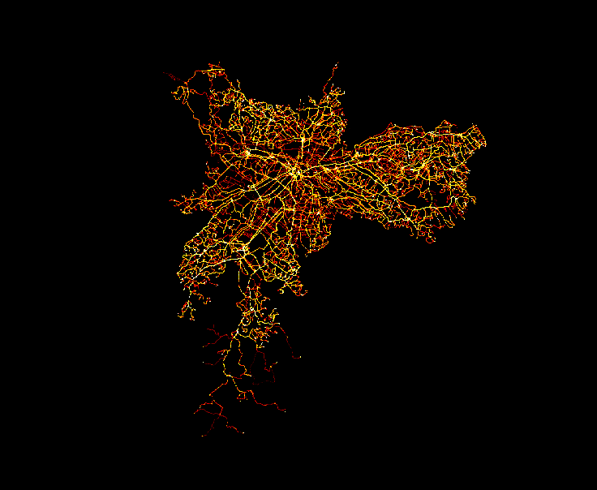

# Objetivo

Utilizar ferramentas Big Data para tratar e visualizar uma grande quantidade de dados de GPS. Os dados de GPS escolhidos foram os feeds de GTFS da SPTRANS do seguinte link: 

https://transitfeeds.com/p/sptrans/.

## Parte 1 - Código executado na máquina virtual

Referência: Aula de Big Data - Professor Murilo Zanini

Fazer download e descompactar o arquivo de feed GTFS da SPTRANS

```
cd Downloads
wget https://transitfeeds.com/p/sptrans/1049/latest/download
mkdir gtfs
cp download gtfs
unzip download
```

Inserindo um dia de um arquivo GTFS

```
Iniciar HDFS
start-dfs.sh
hdfs dfs -mkdir /datasets
hdfs dfs -ls /datasets
hdfs dfs -mkdir /datasets/gtfs_um_dia
hdfs dfs -ls /datasets/gtfs_um_dia
```

Inserindo arquivos no HDFS

```
hdfs dfs -put agency.txt /datasets/gtfs_um_dia 
hdfs dfs -put fare_attributes.txt /datasets/gtfs_um_dia 
hdfs dfs -put routes.txt /datasets/gtfs_um_dia
hdfs dfs -put stop_times.txt /datasets/gtfs_um_dia
hdfs dfs -put calendar.txt /datasets/gtfs_um_dia
hdfs dfs -put fare_rules.txt /datasets/gtfs_um_dia    
hdfs dfs -put shapes.txt /datasets/gtfs_um_dia
hdfs dfs -put trips.txt /datasets/gtfs_um_dia
hdfs dfs -put frequencies.txt /datasets/gtfs_um_dia 
hdfs dfs -put stops.txt /datasets/gtfs_um_dia
hdfs dfs -ls /datasets/gtfs_um_dia
hdfs dfs -ls /datasets/
```


## Parte 2 - Código executado no colab

https://drive.google.com/file/d/1HG7gvcRfK3wy0JD1SDoIrIDtleeYC11z/view?usp=sharing

## Parte 3 - Imagem final renderizada pelo Datashader


